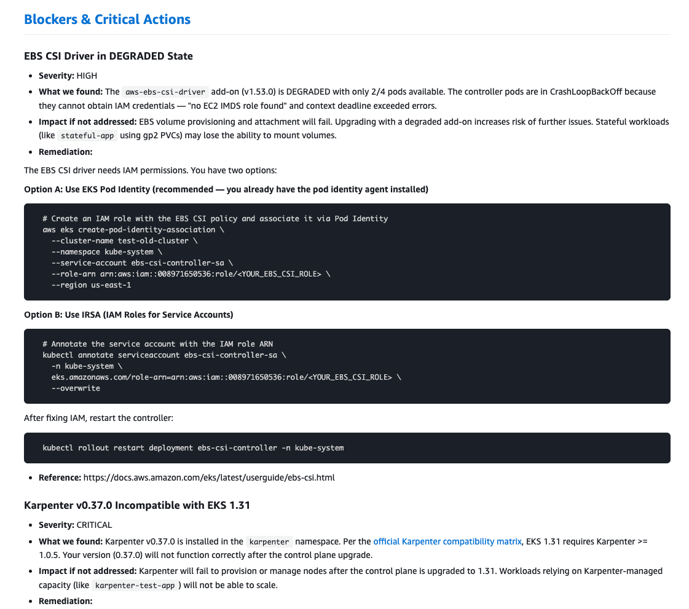

# EKS Upgrade Readiness Skill

[](LICENSE)
[](https://www.python.org/)
[](https://claude.ai/claude-code)

A [Claude Code](https://claude.ai/claude-code) skill that assesses your EKS cluster's readiness for a Kubernetes version upgrade. It connects to a live cluster via the [AWS-managed EKS MCP server](https://docs.aws.amazon.com/eks/latest/userguide/eks-mcp-introduction.html), runs automated checks across 8 areas, calculates a readiness score (0–100%), and generates a detailed report with pre-filled AWS CLI commands.

All operations are **read-only** — the skill does not modify your cluster.

<p align="center">
  
</p>

<details>
<summary><strong>More sample report screenshots</strong></summary>
<br>
<p align="center">
  
</p>
<p align="center">
  
</p>
</details>

## Table of Contents

- [Getting Started](#getting-started)
- [What Gets Assessed](#what-gets-assessed)
- [Readiness Score](#readiness-score)
- [Output](#output)
- [MCP Server Setup](#mcp-server-setup)
- [Required Permissions](#required-permissions)
- [Limitations](#limitations)
- [Troubleshooting](#troubleshooting)
- [Project Structure](#project-structure)
- [Contributing](#contributing)
- [Security](#security)
- [License](#license)

## Getting Started

### Prerequisites

- [Claude Code](https://docs.anthropic.com/en/docs/claude-code) installed
- [Python 3.10+](https://www.python.org/) and [uv](https://docs.astral.sh/uv/getting-started/installation/)
- AWS credentials configured — `aws sts get-caller-identity` should succeed

### Quick Start

```bash
git clone https://github.com/kahhaw9368/eks-upgrade-skill.git
cd eks-upgrade-skill
claude
```

Then run:

```
/eks-upgrade
```

The skill discovers your EKS clusters, asks you to pick one and a target version, runs the assessment, and generates a report with a readiness score and step-by-step upgrade plan.

### Verify Prerequisites

Run the permission check script to validate everything is set up correctly:

```bash
# List available clusters and check basic connectivity
./tools/check_permissions.sh

# Check full permissions against a specific cluster
./tools/check_permissions.sh my-cluster-name us-west-2
```

## What Gets Assessed

| # | Area | Checks |
|---|------|--------|
| 01 | Breaking Changes | Per-version API removals, behavioral changes, resource impact |
| 02 | Deprecated APIs | Live scan of cluster resources + AWS Upgrade Insights |
| 03 | Node Version Skew | AMI type (AL2 → AL2023), container runtime, version skew policy |
| 04 | Add-on Compatibility | Core EKS add-ons, OSS add-ons (via matrix), health status |
| 05 | Karpenter | Version compatibility, CRD API migration (v1beta1 → v1) |
| 06 | Workload Risks | Single replicas, missing PDBs, health probes, resource requests, Recreate strategy |
| 07 | AWS Upgrade Insights | Official EKS pre-upgrade checks and recommendations |
| 08 | Behavioral Changes | Default setting changes, feature gate graduations |

## Readiness Score

| Score | Level | Meaning |
|-------|-------|---------|
| 90–100 | READY | Safe to proceed |
| 80–89 | GOOD | Minor issues — can proceed with caution |
| 70–79 | FAIR | Several issues need attention first |
| 60–69 | RISKY | Significant issues — not recommended yet |
| 0–59 | NOT READY | Critical blockers — must resolve first |

## Output

Reports are generated in the workspace root:

| Format | Filename |
|--------|----------|
| Markdown | `EKS-Upgrade-Assessment-<cluster>-<current>-to-<target>-<date>.md` |
| HTML (optional) | Run `python3 tools/md_to_html.py <report>.md` (zero external dependencies) |

Each report includes a readiness score with breakdown, blocker details with remediation commands, a pre-upgrade checklist, and a step-by-step upgrade plan with pre-filled AWS CLI commands for your cluster.

## MCP Server Setup

This skill requires the [AWS-managed EKS MCP server (preview)](https://docs.aws.amazon.com/eks/latest/userguide/eks-mcp-introduction.html) to interact with your cluster. Configure it in `.mcp.json` at the project root.

<details open>
<summary><strong>AWS-Managed EKS MCP Server</strong></summary>

```json
{
  "mcpServers": {
    "eks-mcp": {
      "command": "uvx",
      "args": [
        "mcp-proxy-for-aws@latest",
        "https://eks-mcp.{region}.api.aws/mcp",
        "--service", "eks-mcp",
        "--profile", "default",
        "--region", "{region}"
      ]
    }
  }
}
```

Replace `{region}` with your AWS region (e.g., `us-west-2`). See the [Getting Started guide](https://docs.aws.amazon.com/eks/latest/userguide/eks-mcp-getting-started.html) for full setup instructions.

</details>

### Customization

To use a specific AWS profile or region, update the `--profile` and `--region` arguments in `.mcp.json`.

## Required Permissions

### AWS IAM

Minimum IAM permissions (read-only):

```
eks:ListClusters, eks:DescribeCluster, eks:ListNodegroups,
eks:DescribeNodegroup, eks:ListAddons, eks:DescribeAddon,
eks:DescribeAddonVersions, eks:ListInsights, eks:DescribeInsight,
eks:ListAccessEntries, eks:DescribeAccessEntry
ec2:DescribeSubnets, ec2:DescribeSecurityGroupRules
iam:GetRole, iam:ListAttachedRolePolicies,
iam:ListRolePolicies, iam:GetRolePolicy
```

<details>
<summary><strong>Full IAM policy JSON</strong></summary>

```json
{
  "Version": "2012-10-17",
  "Statement": [
    {
      "Sid": "EKSReadAccess",
      "Effect": "Allow",
      "Action": [
        "eks:DescribeCluster",
        "eks:ListClusters",
        "eks:ListNodegroups",
        "eks:DescribeNodegroup",
        "eks:ListAddons",
        "eks:DescribeAddon",
        "eks:DescribeAddonVersions",
        "eks:ListInsights",
        "eks:DescribeInsight",
        "eks:ListAccessEntries",
        "eks:DescribeAccessEntry"
      ],
      "Resource": "*"
    },
    {
      "Sid": "EC2ReadAccess",
      "Effect": "Allow",
      "Action": [
        "ec2:DescribeSubnets",
        "ec2:DescribeSecurityGroupRules"
      ],
      "Resource": "*"
    },
    {
      "Sid": "IAMReadAccess",
      "Effect": "Allow",
      "Action": [
        "iam:GetRole",
        "iam:ListAttachedRolePolicies",
        "iam:ListRolePolicies",
        "iam:GetRolePolicy"
      ],
      "Resource": "*"
    }
  ]
}
```

</details>

### Kubernetes RBAC

Your IAM identity needs read access to Kubernetes resources (Nodes, Pods, Deployments, Services, etc.) via an [EKS access entry](https://docs.aws.amazon.com/eks/latest/userguide/access-entries.html) or `aws-auth` ConfigMap.

Recommended: `AmazonEKSClusterAdminPolicy` or `AmazonEKSAdminViewPolicy` access policy.

## Limitations

- **One cluster at a time** — run the skill again for additional clusters.
- **Point-in-time snapshot** — reflects cluster state at the time of the run; does not monitor ongoing changes.
- **Requires cluster access** — your IAM identity must have both AWS API permissions and Kubernetes RBAC access.

## Troubleshooting

<details>
<summary><strong>Cannot list clusters</strong></summary>

1. Check credentials: `aws sts get-caller-identity`
2. Check region: `aws eks list-clusters --region <region>`
3. Run permission check: `./tools/check_permissions.sh`

</details>

<details>
<summary><strong>Permission denied errors</strong></summary>

Run the permission check script — it will tell you exactly which permissions are missing:

```bash
./tools/check_permissions.sh <cluster-name> <region>
```

Ensure your IAM identity has the permissions listed in [Required Permissions](#required-permissions) and has a Kubernetes RBAC binding via [EKS access entry](https://docs.aws.amazon.com/eks/latest/userguide/access-entries.html) or `aws-auth` ConfigMap.

</details>

<details>
<summary><strong>No clusters found</strong></summary>

The skill lists clusters in the region configured in your AWS credentials. Check your `AWS_REGION` and `AWS_PROFILE`, then verify: `aws eks list-clusters --region <region>`

</details>

<details>
<summary><strong>MCP server not responding</strong></summary>

1. Check Python and uv are installed: `uv --version`
2. Check AWS credentials: `aws sts get-caller-identity`
3. Verify `--profile` and `--region` in `.mcp.json` match your environment

</details>

## Project Structure

```
.claude/skills/eks-upgrade/
  SKILL.md                       # Skill definition & workflow
  steering/                      # Per-section assessment instructions
    version-validation.md
    breaking-changes.md
    deprecated-apis.md
    addon-compatibility.md
    node-readiness.md
    workload-risks.md
    upgrade-insights.md
    report-generation.md
  data/
    oss_addon_matrix.json        # OSS add-on compatibility matrix
  tools/
    check_permissions.sh         # Permission validation script
    md_to_html.py                # Markdown → HTML converter
```

## Contributing

Contributions are welcome. Please [open an issue](https://github.com/kahhaw9368/eks-upgrade-skill/issues) first to discuss what you'd like to change.

## Security

This skill is **read-only** and does not create, modify, or delete any AWS or Kubernetes resources. All operations are describe, list, and get calls.

If you discover a security issue, please report it via [GitHub Issues](https://github.com/kahhaw9368/eks-upgrade-skill/issues) rather than a public comment.

## License

This project is licensed under the [Apache 2.0 License](LICENSE).
